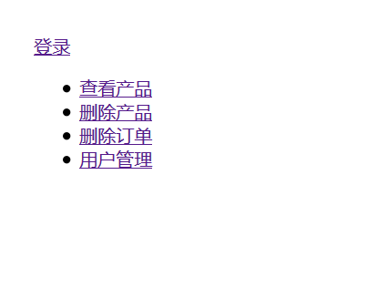
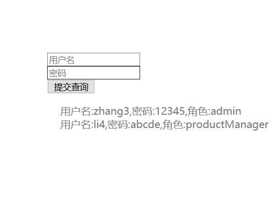
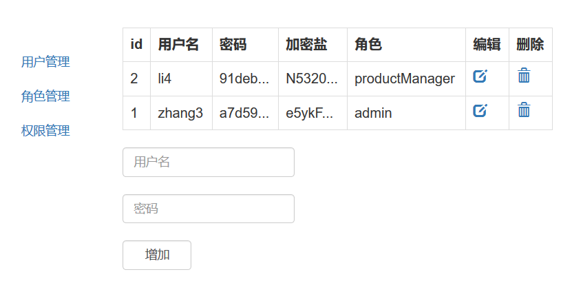
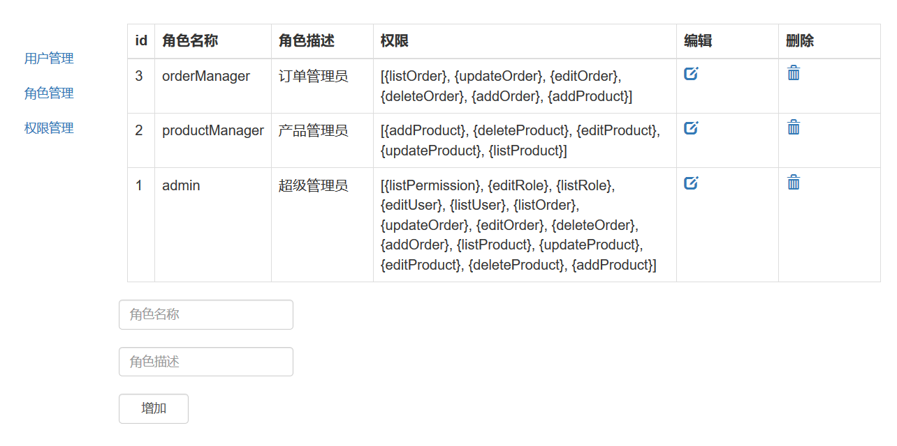

# shiro
SSM整合Shiro，进行权限控制
根据how2java教程学习shiro的过程，通过用户，角色，权限，用户-角色，角色-权限，五张表之间的关系，实现了基本的权限控制。
博客地址:https://www.cnblogs.com/blogforvi/p/11670400.html
index.jsp   主页和登录页无需权限即可访问

login.jsp

访问index.jsp和login.jsp以外的页面的时候，需要先登录，再进行权限检查，用户、角色、权限管理页面只有admin可以访问，
其他的页面根据对应权限分配
listUser.jsp

listRole.jsp

listPermission.jsp

